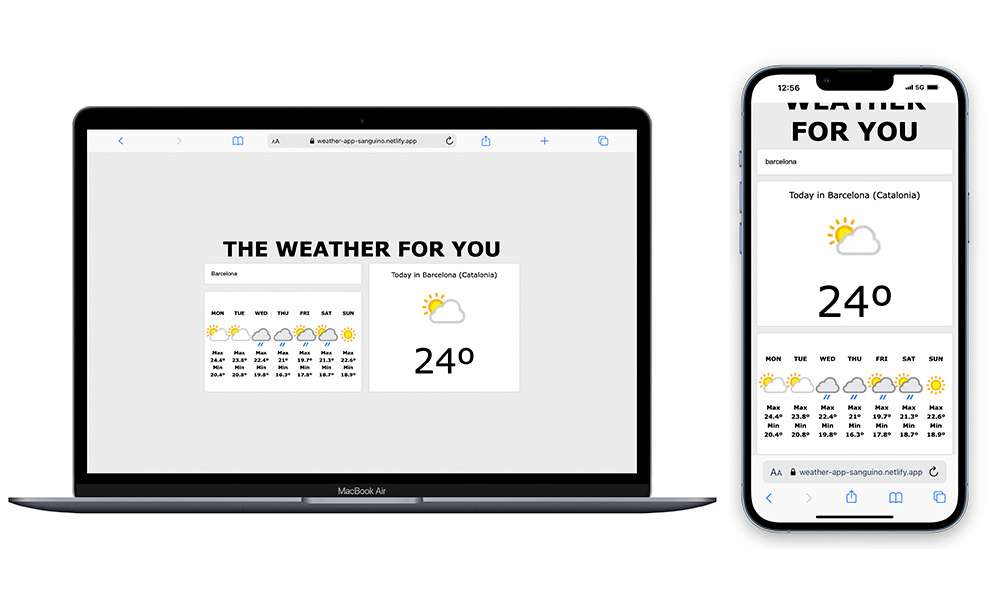

<h1 align="center">🌦️ THE WEATHER FOR YOU ☀️</h1>

A weather forecast app built with <strong>React</strong> and <strong>TypeScript</strong>

<h2>✨ Features:</h2>

<ul>
  <li>🌍 <strong>Geolocation</strong>: If the user grants permission, the app retrieves weather information for the current day and the upcoming 7 days based on their location.</li>
  <li>📱 <strong>Responsive Design</strong>: The app is designed for both laptops and mobile devices.</li>
  <li>⚡ <strong>Efficient Dependency Management</strong>: The project uses <strong>pnpm</strong> as a package manager for better performance.</li>
</ul>

---

<h2>🚀 Installation:</h2>

To clone this repository and run the project locally, follow these steps:

<ol>
  <li>Clone the repository:</li>

  <pre><code>git clone https://github.com/danisanguino/weather.git</code></pre>

  <li>Navigate to the project directory:</li>

  <pre><code>cd weather</code></pre>

  <li>Install dependencies using <strong>pnpm</strong>:</li>

  <pre><code>pnpm install</code></pre>

  <li>Start the development server:</li>

  <pre><code>pnpm run dev</code></pre>
</ol>

---

<h2>💻 Technologies Used:</h2>

<ul>
  <li>⚛️ <strong>React</strong>: Frontend framework for building the user interface.</li>
  <li>🟦 <strong>TypeScript</strong>: For static typing and better code maintainability.</li>
  <li>🌐 <strong>REST API</strong>: Consumes weather data from <a href="https://www.weatherapi.com/">WeatherApi</a>.</li>
  <li>📦 <strong>pnpm</strong>: Package manager used for optimized dependency management.</li>
  <li>🌍 <strong>Geolocation</strong>: Allows the app to fetch weather data based on the user's current location.</li>
</ul>

Feel free to explore, contribute, or provide feedback! 😊

